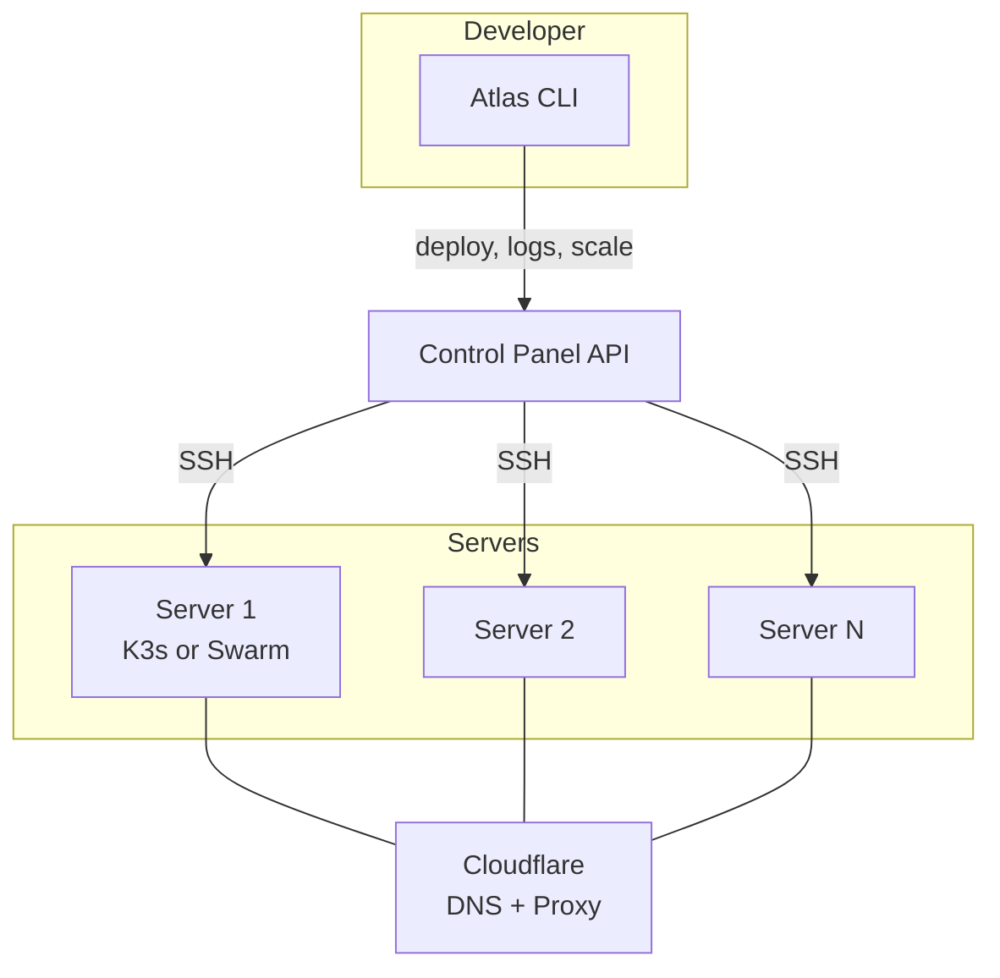
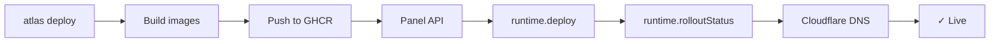

## Overview

Atlas follows a **hub-and-spoke** model. The Control Panel is the hub — CLI and Web UI are spokes.

## Server stack

Each server provisioned by Atlas includes:

### Docker Swarm

| Component | Purpose |
|-----------|---------|
| Docker + Swarm | Container orchestration |
| Traefik v3 | Ingress + ACME HTTPS |
| Prometheus + Grafana | Metrics dashboards |
| Loki + Promtail | Log aggregation |
| cAdvisor + Node Exporter | Container + host metrics |

### K3s (Kubernetes)

| Component | Purpose |
|-----------|---------|
| K3s | Lightweight Kubernetes |
| Traefik v3 (Helm) | Ingress + HTTPS redirect |
| cert-manager | Let's Encrypt automation |
| Prometheus + Grafana (Helm) | Metrics dashboards |
| Loki + Alloy (Helm) | Log aggregation |
| ArgoCD | GitOps deployment |

## Deploy pipeline

The `runtime` abstraction means the same deploy flow works for both K3s and Swarm.

## Security model

| Layer | Mechanism |
|-------|-----------|
| Auth | GitHub OAuth → JWT (HMAC-SHA256, 30-day expiry) |
| Authorization | RBAC: admin, dev, viewer |
| Secrets | AES-256-GCM encryption at rest |
| Transport | HTTPS everywhere (Traefik) |
| DNS | Cloudflare proxy (DDoS protection) |
| Cluster access | SSH tunnel (no exposed API server) |
| Join tokens | Encrypted via `@atlas/crypto` |

## Tech stack

| Layer | Technology |
|-------|-----------|
| Monorepo | Bun + Turborepo |
| CLI | citty + OpenTUI + @clack/prompts |
| Panel API | Elysia + oRPC |
| Database | Drizzle ORM + PostgreSQL |
| Encryption | AES-256-GCM (Web Crypto API) |
| Runtime | K3s or Docker Swarm (`@atlas/runtime`) |
| Ingress | Traefik v3 |
| DNS | Cloudflare API |
| Registry | GitHub Container Registry |
| Lint | Biome |
