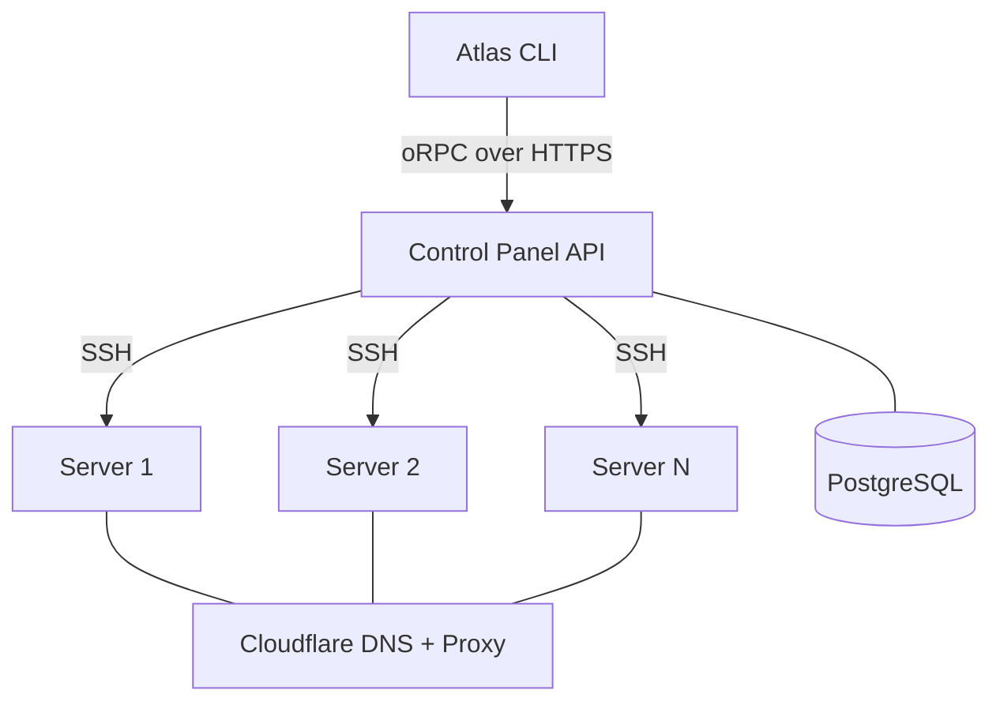
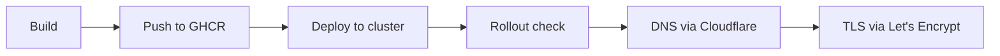

## Overview

Atlas uses a hub-and-spoke architecture. The Control Panel API is the central hub. The CLI and all server operations flow through it.

For single-server setups, the CLI can bypass the Panel and communicate directly with the server via SSH.

## Server stack

Each provisioned server runs a complete production stack. The components vary by runtime:

### K3s

| Component | Purpose |
|-----------|---------|
| K3s | Lightweight Kubernetes |
| Traefik v3 (Helm) | Ingress controller |
| cert-manager | TLS certificate automation |
| Prometheus + Grafana | Metrics and dashboards |
| Loki + Alloy | Log aggregation |
| ArgoCD | GitOps (optional) |

### Docker Swarm

| Component | Purpose |
|-----------|---------|
| Docker + Swarm mode | Container orchestration |
| Traefik v3 (Docker service) | Ingress + ACME TLS |
| Prometheus + Grafana | Metrics |
| Loki + Promtail | Logs |
| cAdvisor + node-exporter | Container and host metrics |

### Firecracker

| Component | Purpose |
|-----------|---------|
| Firecracker | microVM hypervisor |
| atlas-vmm | VM lifecycle daemon (Unix socket API) |
| Traefik v3 (systemd binary) | Ingress + ACME TLS |
| node-exporter | Host metrics |

## Deploy pipeline

The `@atlas/runtime` package abstracts the differences between K3s, Swarm, and Firecracker. The same deploy pipeline works across all three.

## Security

| Layer | Mechanism |
|-------|-----------|
| Authentication | GitHub OAuth → JWT (HMAC-SHA256, 30-day expiry) |
| Authorization | RBAC with three roles: admin, dev, viewer |
| Secrets at rest | AES-256-GCM via Web Crypto API |
| Transport | HTTPS (Traefik + Let's Encrypt) |
| DNS | Cloudflare proxy (DDoS protection, CDN) |
| Server access | SSH with ControlMaster multiplexing |
| Audit | All admin actions logged to audit_log table |

## Tech stack

| Layer | Technology |
|-------|-----------|
| Monorepo | Bun + Turborepo |
| CLI | citty + OpenTUI + @clack/prompts |
| Panel API | Elysia + oRPC |
| Database | PostgreSQL 17 + Drizzle ORM |
| Validation | Zod 4 |
| Encryption | AES-256-GCM (Web Crypto API) |
| Ingress | Traefik v3 |
| DNS | Cloudflare API |
| Registry | GitHub Container Registry |
| Lint | Biome |

## Packages

The monorepo contains shared packages used by both the CLI and Panel:

| Package | Responsibility |
|---------|---------------|
| `@atlas/api` | oRPC router contract and shared types (CLI ↔ Panel) |
| `@atlas/auth` | JWT sign, verify, and role guards |
| `@atlas/crypto` | AES-256-GCM encrypt/decrypt |
| `@atlas/db` | Drizzle schema, relations, and database client |
| `@atlas/env` | Zod-validated environment variables |
| `@atlas/ssh` | SSH client with ControlMaster connection pooling |
| `@atlas/cloudflare` | Cloudflare API client (DNS + Tunnels) |
| `@atlas/runtime` | Container runtime abstraction (K3s, Swarm, Firecracker) |
| `@atlas/provisioner` | Server provisioning phase scripts |
| `@atlas/firecracker` | Firecracker-specific provisioner and runtime |
