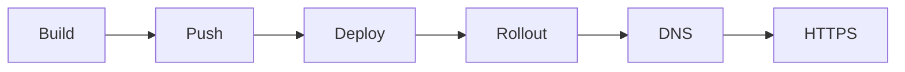

```bash
atlas deploy
```

## Pipeline



## 1. Build

Atlas reads `atlas.yaml`, identifies each service, and runs `docker build` with the specified Dockerfile.

Platform detection is automatic. Atlas detects the server architecture during `atlas infra setup` and stores it in `~/.atlas/config.json`. If the server is `x86_64` and your machine is `arm64`, Atlas uses `docker buildx build --platform linux/amd64 --push` for cross-compilation.

You can override the platform in `atlas.yaml`:

```yaml
platform: linux/amd64
```

## 2. Push

Images are pushed to GitHub Container Registry at `ghcr.io/{org}/{project}/{service}:{tag}`.

The default tag is the current git short SHA. Override with `--tag`:

```bash
atlas deploy --tag v1.2.0
```

If buildx was used for cross-compilation, the push happens during the build step (`--push` flag). Otherwise, Atlas runs `docker push` separately.

## 3. Deploy

Two modes:

| Mode | Trigger | Flow |
|------|---------|------|
| Panel (default) | CLI calls `deploys.trigger` via oRPC | Panel SSHs into server, updates containers |
| Direct | `--host` flag | CLI SSHs into server directly |

Panel mode is the default when `panelUrl` and `panelToken` are configured. Direct mode is useful for single-server setups or debugging.

The deploy step varies by runtime:

- K3s: `kubectl set image deployment/{service} {service}={image}` (creates Deployment + Service if first deploy)
- Swarm: `docker service update --image {image}` (creates service if first deploy)
- Firecracker: `POST /rootfs/build` then `POST /vms` via atlas-vmm socket

A service named `migrate` in `atlas.yaml` runs as a one-shot job before other services are deployed.

## 4. Rollout

Atlas waits for the new containers to become healthy:

- K3s: `kubectl rollout status deployment/{service} --timeout=120s`
- Swarm: Polls until running replicas match desired replicas
- Firecracker: Polls `GET /vms/{stack}/{service}` until `status: running` and `healthy: true`

## 5. DNS

If a service has a `domain` field in `atlas.yaml`, Atlas calls the Cloudflare API to create or update an A record pointing to the server IP. The operation is idempotent.

## 6. HTTPS

TLS certificates are provisioned automatically after DNS is configured:

- K3s: cert-manager requests a Let's Encrypt certificate via HTTP-01 challenge
- Swarm: Traefik's built-in ACME resolver handles certificate issuance
- Firecracker: Traefik's ACME resolver (same as Swarm, running as systemd service)

## Dry run

Simulate the deploy TUI without executing any actions:

```bash
atlas deploy --dry-run
```

Shows the full interactive UI with simulated step progression. Useful for testing TUI rendering or demonstrating the deploy flow.
