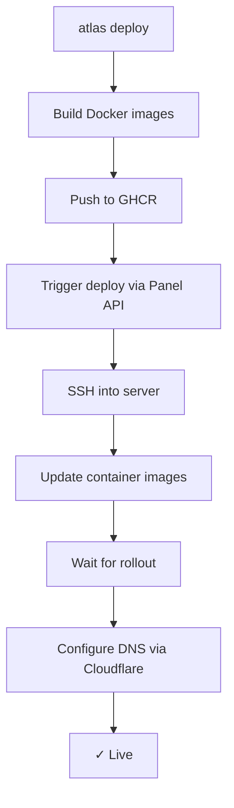

```bash
atlas deploy
```

Here's what happens behind the scenes:



## Step by step

### 1. Build

Atlas reads your `atlas.yaml`, finds each service, and builds a Docker image using the service's Dockerfile.

### 2. Push

Images are pushed to GitHub Container Registry (`ghcr.io/your-org/your-project`).

### 3. Deploy

The CLI calls the Control Panel API, which SSHs into your server and updates the running containers:

- **K3s:** `kubectl set image deployment/service image:tag`
- **Swarm:** `docker service update --image image:tag`

### 4. Rollout

Atlas waits for the new containers to be healthy before proceeding:

- **K3s:** `kubectl rollout status`
- **Swarm:** Polls replica count until desired = running

### 5. DNS

If the service has a `domain` in `atlas.yaml`, Atlas calls the Cloudflare API to create or update DNS records. Idempotent — safe to run repeatedly.

### 6. HTTPS

- **K3s:** cert-manager provisions a Let's Encrypt certificate automatically
- **Swarm:** Traefik's built-in ACME resolver handles it

No manual certificate management. Ever.

## Direct mode vs Panel mode

- **Panel mode** (default): CLI → Panel API → SSH → Server
- **Direct mode** (`--host` flag): CLI → SSH → Server directly

Direct mode skips the Panel. Useful for single-server setups or debugging.
