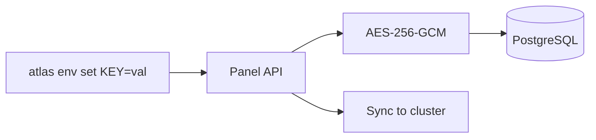

Every secret in Atlas is encrypted before it reaches the database. The Panel encrypts values on write and decrypts on read. Plain text secrets never exist at rest.

## Encryption flow



## Setting secrets

```bash
atlas env set DATABASE_URL=postgres://... REDIS_URL=redis://...
```

1. CLI sends key-value pairs to the Panel API over HTTPS
2. Panel encrypts each value with AES-256-GCM
3. Encrypted values are stored in PostgreSQL
4. Panel syncs decrypted values to the cluster runtime

## Reading secrets

```bash
atlas env list    # Shows keys only, values are masked
atlas env pull    # Downloads decrypted values to local .env file
```

## Deleting secrets

```bash
atlas env set --delete MY_KEY
```

Removes the key from both the database and the cluster.

## Cluster sync

After encryption and storage, the Panel syncs secrets to the running cluster. The mechanism depends on the runtime:

| Runtime | Sync method |
|---------|-------------|
| K3s | `kubectl patch secret {name} -p '{"data":{...}}'` (base64-encoded values) |
| Swarm | `docker service update --env-add KEY=VALUE` on each service |
| Firecracker | `POST /vms/{stack}/{service}/env` via atlas-vmm Unix socket |

## Encryption details

| Property | Value |
|----------|-------|
| Algorithm | AES-256-GCM |
| Implementation | Web Crypto API (`crypto.subtle`) |
| IV | 12 bytes, randomly generated per encryption |
| Key derivation | SHA-256 hash of `ENCRYPTION_KEY` env var |
| Output format | Base64(IV ‖ ciphertext ‖ auth tag) |

The `ENCRYPTION_KEY` environment variable is set on the Panel. It is never stored in the database.

## What gets encrypted

- Environment variables (project secrets)
- Cloudflare API tokens
- GitHub tokens
- Kubeconfigs (K3s)
- Swarm join tokens (worker and manager)
- GitHub OAuth client secrets

All sensitive values pass through `@atlas/crypto`. There are no exceptions.
