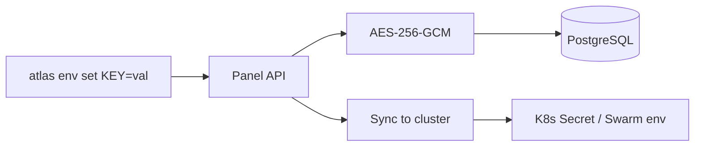

Every secret in Atlas is encrypted with **AES-256-GCM** before it touches the database. No plain text. Ever.

## How it works



### Setting a secret

```bash
atlas env set DATABASE_URL=postgres://... REDIS_URL=redis://...
```

1. CLI sends the key-value pairs to the Panel API (over HTTPS)
2. Panel encrypts each value with AES-256-GCM using the `ENCRYPTION_KEY`
3. Encrypted values are stored in PostgreSQL
4. Panel syncs to the cluster:
   - **K3s:** `kubectl patch secret` (merge strategy)
   - **Swarm:** `docker service update --env-add`

### Reading secrets

```bash
atlas env list    # Shows keys only (values hidden)
atlas env pull    # Downloads decrypted .env file
```

`env list` never exposes values. `env pull` decrypts server-side and streams to your local `.env`.

### Deleting a secret

```bash
atlas env delete MY_KEY
```

Removes from both the database and the cluster secret.

## Encryption details

| Property | Value |
|----------|-------|
| Algorithm | AES-256-GCM |
| Implementation | Web Crypto API (`crypto.subtle`) |
| IV | 12-byte random per encryption |
| Key derivation | SHA-256 hash of `ENCRYPTION_KEY` |
| Output format | Base64(IV ∥ ciphertext) |

The encryption key is set via the `ENCRYPTION_KEY` environment variable on the Panel. It's never stored in the database.

## What gets encrypted

- Environment variables (secrets)
- Cloudflare API tokens
- GitHub tokens
- Kubeconfigs
- Swarm join tokens

Everything sensitive uses `@atlas/crypto`. No exceptions.
