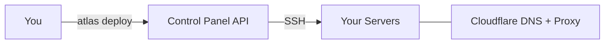

You write code. Atlas handles infrastructure.

Point it at any VPS — Hetzner, DigitalOcean, AWS, bare metal — and get DNS, HTTPS, secrets, monitoring, and deploys. One command.

```bash
atlas deploy
```

## What Atlas does

You define your stack in `atlas.yaml`:

```yaml
name: myapp
services:
  api:
    type: api
    port: 3001
    domain: api.myapp.com
  web:
    type: web
    domain: myapp.com

infra:
  postgres: true
  redis: true
```

Atlas reads this and:

1. **Builds** Docker images for each service
2. **Pushes** to GitHub Container Registry
3. **Deploys** to your cluster (K3s or Docker Swarm — you pick)
4. **Configures DNS** via Cloudflare
5. **Provisions HTTPS** via Let's Encrypt
6. **Syncs secrets** encrypted with AES-256-GCM

No Terraform. No Helm charts. No 200-line CI/CD pipelines.

## What you get

- **Two runtimes** — K3s (Kubernetes) or Docker Swarm. Switch anytime.
- **Automatic DNS & HTTPS** — Cloudflare + Let's Encrypt. Zero config.
- **Encrypted secrets** — AES-256-GCM at rest. Synced to your cluster.
- **Preview environments** — One branch = one URL.
- **Built-in monitoring** — Prometheus, Grafana, Loki. Pre-configured.
- **20+ CLI commands** — Deploy, scale, logs, exec, restart, env, db, preview.

## Architecture



The **Control Panel** is the brain. The CLI talks to it. Every action — deploy, scale, restart — flows through the Panel API to your servers via SSH.

## Next steps

<Cards>
  <Card title="Install Atlas" href="/docs/getting-started/installation" />
  <Card title="Quick Start" href="/docs/getting-started/quick-start" />
  <Card title="Choose a Runtime" href="/docs/concepts/runtimes" />
  <Card title="Project Config" href="/docs/getting-started/project-config" />
</Cards>
