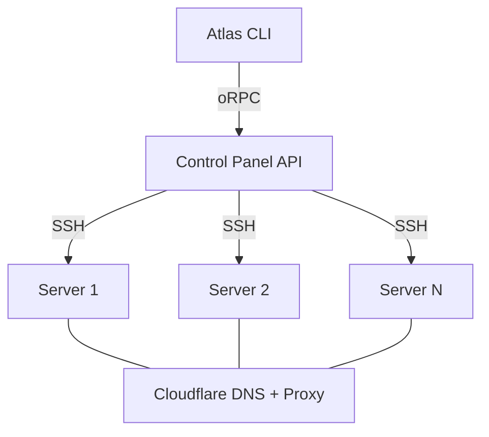

Atlas deploys your applications to any VPS. You define services in `atlas.yaml`, run `atlas deploy`, and Atlas handles the rest: container builds, image registry, DNS records, TLS certificates, secrets encryption, and monitoring.

## What Atlas does

```bash
atlas deploy
```

1. Builds Docker images for each service
2. Pushes to GitHub Container Registry
3. Deploys to your cluster via SSH
4. Configures DNS records via Cloudflare
5. Provisions TLS certificates via Let's Encrypt
6. Syncs secrets encrypted with AES-256-GCM

## Runtimes

You choose the container runtime during server provisioning. Atlas supports three:

| | K3s | Docker Swarm | Firecracker |
|---|---|---|---|
| Type | Lightweight Kubernetes | Docker-native orchestration | microVM isolation |
| RAM overhead | ~512MB | ~100MB | ~5MB per VM |
| Best for | Teams needing Helm, ArgoCD, HPA | Small teams, 1-2GB RAM servers | Bare metal with KVM, security-first |
| Setup time | ~5 min | ~2 min | ~3 min |

Switch between runtimes at any time with `atlas infra migrate`.

## Architecture

Atlas follows a hub-and-spoke model. The Control Panel is the central API. The CLI communicates with it. Every action flows through the Panel to your servers via SSH.



For single-server setups, the CLI can also deploy directly via SSH without the Panel.

## Project configuration

Every project has an `atlas.yaml` at the root:

```yaml
name: myapp
org: my-org
domain: myapp.com

services:
  api:
    type: api
    port: 3001
    domain: api.myapp.com
  web:
    type: web
    domain: myapp.com

infra:
  postgres: true
  redis: true
```

Atlas reads this file to determine what to build, where to deploy, and how to configure networking.

## Next steps

<Cards>
  <Card title="Installation" href="/docs/getting-started/installation" />
  <Card title="Quick Start" href="/docs/getting-started/quick-start" />
  <Card title="Runtimes" href="/docs/concepts/runtimes" />
  <Card title="Project Config" href="/docs/getting-started/project-config" />
</Cards>
